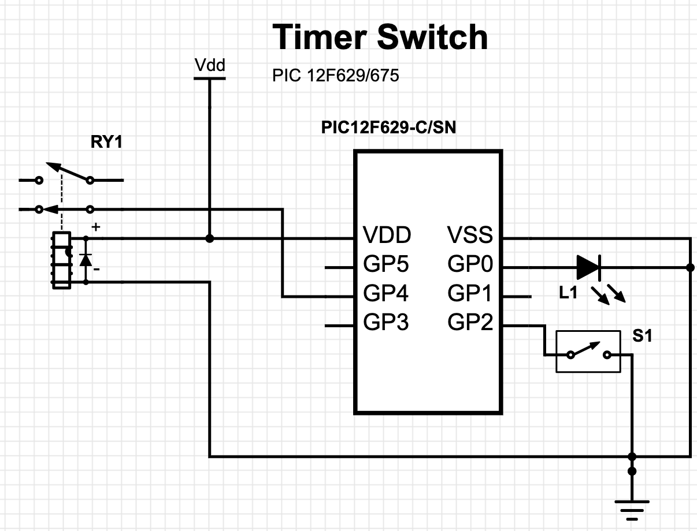

# Auto Timer Switch

Simple circuit to control a relay and a timer built with MCU PIC 12F675.

_Workflow_: After pressing the switch button, the relay will be turned on and a timer will count 1h30h to shut the relay down. During this period, if the switch button gets pressed again, it will reset the counter. An optional Led can be attached to GP0 to check the heart beat.

## Schematics do Projeto em:

* https://www.digikey.com/schemeit/project/timer-switch-pic-4PMJKQ03009G/

## PIC 12F629/675 Datasheet

https://ww1.microchip.com/downloads/en/devicedoc/41190c.pdf

## Applications

* Control the time that the towel dryer remains on.
* Possibly others

## Dev Env

* MPLABX 4.0 with XC8 compiler
* PICKIT 3

### Tips

* If using IPE to program, never forget to reload HEX after each build.
* The `OSCCAL = __osccal_val();`line must be commeted out for simulating (this problem came with the latest version o MPLAB).
